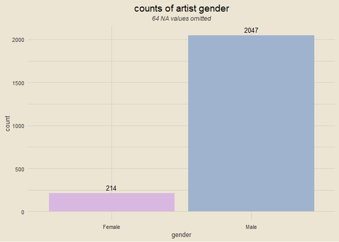
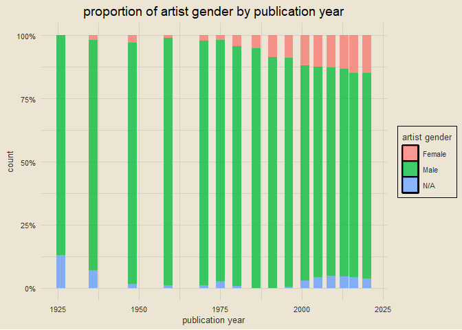
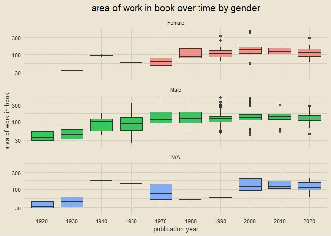
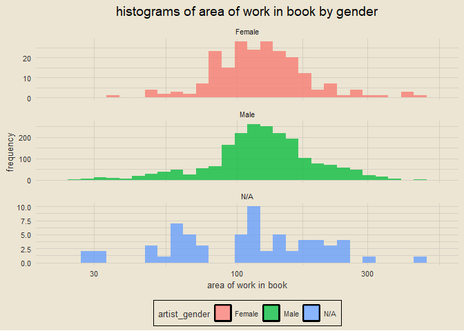
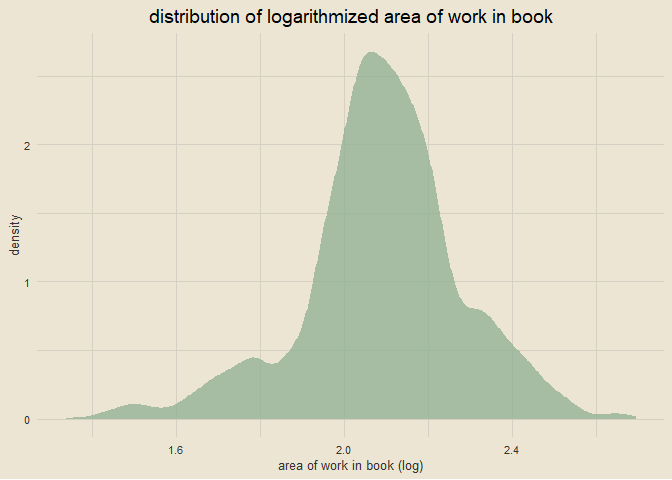
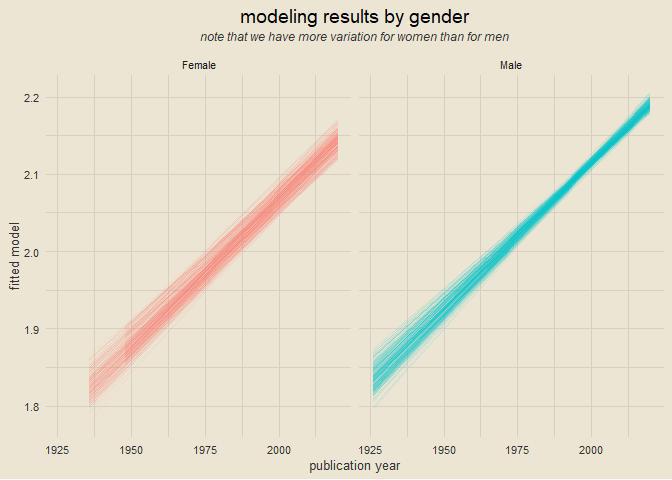

resampling to understand gender in art history textbooks
================

### setup

``` r
library(tidyverse)
library(tidymodels)
library(tvthemes)
library(arthistory)

theme_custom = theme_avatar() +
  theme(plot.title = element_text(hjust = 0.5),
        panel.grid.major = element_line(linewidth = 0.5, colour = "#D6D0C4"),
        panel.grid.minor = element_line(linewidth = 0.5, colour = "#D6D0C4"))

theme_set(theme_custom)
```

------------------------------------------------------------------------

### data import

``` r
data(worksgardner)
glimpse(worksgardner)
```

    ## Rows: 2,325
    ## Columns: 24
    ## $ artist_name            <chr> "Aaron Douglas", "Aaron Douglas", "Aaron Dougla~
    ## $ edition_number         <dbl> 9, 10, 11, 12, 13, 14, 15, 16, 14, 15, 16, 5, 6~
    ## $ title_of_work          <chr> "Noah's Ark", "Noah's Ark", "Noah's Ark", "Noah~
    ## $ publication_year       <dbl> 1991, 1996, 2001, 2005, 2009, 2013, 2016, 2020,~
    ## $ page_number_of_image   <chr> "965", "1053", "1030", "990", "937", "867", "91~
    ## $ artist_unique_id       <dbl> 1, 1, 1, 1, 1, 1, 1, 1, 2, 2, 2, 3, 3, 3, 3, 3,~
    ## $ artist_nationality     <chr> "American", "American", "American", "American",~
    ## $ artist_gender          <chr> "Male", "Male", "Male", "Male", "Male", "Male",~
    ## $ artist_race            <chr> "Black or African American", "Black or African ~
    ## $ artist_ethnicity       <chr> "Not Hispanic or Latinx", "Not Hispanic or Lati~
    ## $ height_of_work_in_book <dbl> 11.3, 12.1, 12.3, 12.3, 12.8, 12.8, 12.7, 7.9, ~
    ## $ width_of_work_in_book  <dbl> 8.5, 8.9, 8.8, 8.8, 9.3, 9.3, 9.2, 19.0, 10.2, ~
    ## $ height_of_text         <dbl> 14.5, 12.4, 10.8, 15.7, 15.0, 18.8, 21.2, 14.7,~
    ## $ width_of_text          <dbl> 8.4, 9.0, 9.0, 8.9, 9.3, 9.3, 9.2, 13.9, 9.3, 9~
    ## $ extra_text_height      <dbl> 0.0, 0.0, 0.0, 0.0, 0.0, 0.0, 0.0, 0.0, 9.2, 0.~
    ## $ extra_text_width       <dbl> 0.0, 0.0, 0.0, 0.0, 0.0, 0.0, 0.0, 0.0, 8.8, 0.~
    ## $ area_of_work_in_book   <dbl> 96.05, 107.69, 108.24, 108.24, 119.04, 119.04, ~
    ## $ area_of_text           <dbl> 121.80, 111.60, 97.20, 139.73, 139.50, 174.84, ~
    ## $ extra_text_area        <dbl> 0.00, 0.00, 0.00, 0.00, 0.00, 0.00, 0.00, 0.00,~
    ## $ total_area_text        <dbl> 121.80, 111.60, 97.20, 139.73, 139.50, 174.84, ~
    ## $ total_space            <dbl> 217.85, 219.29, 205.44, 247.97, 258.54, 293.88,~
    ## $ page_area              <dbl> 616.500, 586.420, 677.440, 657.660, 648.930, 64~
    ## $ space_ratio_per_page   <dbl> 0.3533658, 0.3739470, 0.3032593, 0.3770489, 0.3~
    ## $ book                   <chr> "gardner", "gardner", "gardner", "gardner", "ga~

------------------------------------------------------------------------

### visualizing counts of gender in the data

``` r
worksgardner |>
  filter(artist_gender != "N/A") |>
  count(artist_gender) |>
  ggplot(aes(artist_gender, n)) +
  geom_col(aes(fill = artist_gender), show.legend = F) +
  geom_text(aes(label = n), vjust = -0.5, size = 3.5) +
  scale_fill_manual(values = c("#D8B8E1", "#9FB3CE")) +
  labs(x = "gender", y = "count", title = "counts of artist gender",
       subtitle = paste0(nrow(filter(worksgardner, artist_gender == "N/A")), " NA values omitted")) +
  theme(plot.subtitle = element_text(hjust = 0.5, vjust = 2.5, size = 9, face = "italic"))
```

<!-- -->

------------------------------------------------------------------------

### visualizing artist gender over time

``` r
worksgardner |>
  count(publication_year, artist_gender) |>
  group_by(publication_year) |>
  mutate(prop = n / sum(n)) |>
  ggplot(aes(publication_year, prop)) +
  geom_col(aes(fill = artist_gender), alpha = 0.75) +
  labs(x = "publication year", y = "count", fill = "artist gender",
       title = "proportion of artist gender by publication year") +
  scale_y_continuous(labels = scales::percent) +
  theme(legend.position = "right")
```

<!-- -->

------------------------------------------------------------------------

### visualizing area of work over time by gender

``` r
worksgardner |>
  mutate(publication_year = (publication_year %/% 10) * 10,
         publication_year = factor(publication_year)) |>
  ggplot(aes(publication_year, area_of_work_in_book)) +
  geom_boxplot(aes(fill = artist_gender), alpha = 0.75, show.legend = F) +
  facet_wrap(vars(artist_gender), ncol = 1) +
  scale_y_log10() +
  labs(x = "publication year", y = "area of work in book",
       title = "area of work in book over time by gender")
```

<!-- -->

------------------------------------------------------------------------

### histograms of area of work by gender

``` r
worksgardner |>
  ggplot(aes(area_of_work_in_book)) +
  geom_histogram(aes(fill = artist_gender), bins = 30, position = "identity", alpha = 0.75) +
  facet_wrap(vars(artist_gender), scales = "free_y", ncol = 1) +
  scale_x_log10() +
  labs(x = "area of work in book", y = "frequency",
       title = "histograms of area of work in book by gender")
```

<!-- -->

------------------------------------------------------------------------

### preparing data for modeling

``` r
works_subset = worksgardner |>
  filter(artist_gender %in% c("Female", "Male") & area_of_work_in_book > 0) |>
  mutate(area_of_work_in_book = log10(area_of_work_in_book))

works_subset |>
  ggplot(aes(area_of_work_in_book)) +
  geom_density(fill = "#8FB094", alpha = 0.75, col = "transparent") +
  labs(x = "area of work in book (log)", y = "density",
       title = "distribution of logarithmized area of work in book")
```

<!-- -->

------------------------------------------------------------------------

### fitting a single linear model

``` r
single_model = lm(area_of_work_in_book ~ artist_gender + publication_year, data = works_subset)
summary(single_model)
```

    ## 
    ## Call:
    ## lm(formula = area_of_work_in_book ~ artist_gender + publication_year, 
    ##     data = works_subset)
    ## 
    ## Residuals:
    ##      Min       1Q   Median       3Q      Max 
    ## -0.56303 -0.10616 -0.01543  0.08998  0.65367 
    ## 
    ## Coefficients:
    ##                     Estimate Std. Error t value Pr(>|t|)    
    ## (Intercept)       -5.4720296  0.3437408 -15.919  < 2e-16 ***
    ## artist_genderMale  0.0468432  0.0126179   3.712  0.00021 ***
    ## publication_year   0.0037704  0.0001713  22.006  < 2e-16 ***
    ## ---
    ## Signif. codes:  0 '***' 0.001 '**' 0.01 '*' 0.05 '.' 0.1 ' ' 1
    ## 
    ## Residual standard error: 0.1732 on 2242 degrees of freedom
    ## Multiple R-squared:  0.1776, Adjusted R-squared:  0.1769 
    ## F-statistic: 242.1 on 2 and 2242 DF,  p-value: < 2.2e-16

------------------------------------------------------------------------

### creating bootstrap folds

``` r
set.seed(123)
folds = bootstraps(works_subset, times = 250)
folds
```

    ## # Bootstrap sampling 
    ## # A tibble: 250 x 2
    ##    splits             id          
    ##    <list>             <chr>       
    ##  1 <split [2245/825]> Bootstrap001
    ##  2 <split [2245/821]> Bootstrap002
    ##  3 <split [2245/827]> Bootstrap003
    ##  4 <split [2245/841]> Bootstrap004
    ##  5 <split [2245/808]> Bootstrap005
    ##  6 <split [2245/823]> Bootstrap006
    ##  7 <split [2245/833]> Bootstrap007
    ##  8 <split [2245/825]> Bootstrap008
    ##  9 <split [2245/823]> Bootstrap009
    ## 10 <split [2245/840]> Bootstrap010
    ## # ... with 240 more rows

------------------------------------------------------------------------

### building models

``` r
linear_coefs = folds |>
  mutate(model = map(splits, ~ lm(area_of_work_in_book ~ artist_gender + publication_year,
                                  data = analysis(.x))),
         coef_info = map(model, tidy))

linear_coefs
```

    ## # Bootstrap sampling 
    ## # A tibble: 250 x 4
    ##    splits             id           model  coef_info       
    ##    <list>             <chr>        <list> <list>          
    ##  1 <split [2245/825]> Bootstrap001 <lm>   <tibble [3 x 5]>
    ##  2 <split [2245/821]> Bootstrap002 <lm>   <tibble [3 x 5]>
    ##  3 <split [2245/827]> Bootstrap003 <lm>   <tibble [3 x 5]>
    ##  4 <split [2245/841]> Bootstrap004 <lm>   <tibble [3 x 5]>
    ##  5 <split [2245/808]> Bootstrap005 <lm>   <tibble [3 x 5]>
    ##  6 <split [2245/823]> Bootstrap006 <lm>   <tibble [3 x 5]>
    ##  7 <split [2245/833]> Bootstrap007 <lm>   <tibble [3 x 5]>
    ##  8 <split [2245/825]> Bootstrap008 <lm>   <tibble [3 x 5]>
    ##  9 <split [2245/823]> Bootstrap009 <lm>   <tibble [3 x 5]>
    ## 10 <split [2245/840]> Bootstrap010 <lm>   <tibble [3 x 5]>
    ## # ... with 240 more rows

------------------------------------------------------------------------

### getting linear coefficients

``` r
linear_coefs |>
  unnest(coef_info)
```

    ## # A tibble: 750 x 8
    ##    splits             id          model term  estimate std.e~1 stati~2   p.value
    ##    <list>             <chr>       <lis> <chr>    <dbl>   <dbl>   <dbl>     <dbl>
    ##  1 <split [2245/825]> Bootstrap0~ <lm>  (Int~ -5.41    3.45e-1  -15.7  1.18e- 52
    ##  2 <split [2245/825]> Bootstrap0~ <lm>  arti~  0.0270  1.28e-2    2.11 3.47e-  2
    ##  3 <split [2245/825]> Bootstrap0~ <lm>  publ~  0.00374 1.72e-4   21.8  1.67e- 95
    ##  4 <split [2245/821]> Bootstrap0~ <lm>  (Int~ -5.97    3.35e-1  -17.8  1.63e- 66
    ##  5 <split [2245/821]> Bootstrap0~ <lm>  arti~  0.0574  1.33e-2    4.32 1.62e-  5
    ##  6 <split [2245/821]> Bootstrap0~ <lm>  publ~  0.00402 1.67e-4   24.0  1.06e-113
    ##  7 <split [2245/827]> Bootstrap0~ <lm>  (Int~ -5.43    3.27e-1  -16.6  1.22e- 58
    ##  8 <split [2245/827]> Bootstrap0~ <lm>  arti~  0.0516  1.21e-2    4.26 2.13e-  5
    ##  9 <split [2245/827]> Bootstrap0~ <lm>  publ~  0.00375 1.63e-4   23.0  1.92e-105
    ## 10 <split [2245/841]> Bootstrap0~ <lm>  (Int~ -5.80    3.39e-1  -17.1  1.14e- 61
    ## # ... with 740 more rows, and abbreviated variable names 1: std.error,
    ## #   2: statistic

------------------------------------------------------------------------

### visualizing model results

``` r
linear_coefs |>
  mutate(augmented = map(model, augment)) |>
  unnest(augmented) |>
  ggplot(aes(publication_year, .fitted)) +
  geom_line(aes(col = artist_gender, group = id), alpha = 0.1, show.legend = F) +
  facet_wrap(vars(artist_gender)) +
  labs(x = "publication year", y = "fitted model",
       title = "modeling results by gender",
       subtitle = "note that we have more variation for women than for men") +
  theme(plot.subtitle = element_text(size = 9, vjust = 2.5, face = "italic", hjust = 0.5))
```

<!-- -->
